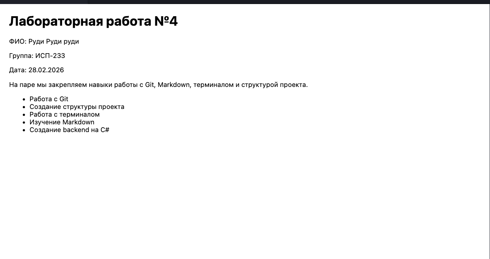

# H1 Заголовок

## H2 Заголовок

### H3 Заголовок

#### H4 Заголовок

##### H5 Заголовок

###### H6 Заголовок

---

## Форматирование текста

**Жирный текст**

_Курсив_

~~Зачёркнутый~~

`Моноширный текст`

---

## Списки

### Маркированный

- Первый пункт
- Второй пункт
- Третий пункт

### Нумерованный

1. Первый
2. Второй
3. Третий

### Вложенный

- Пункт
  - Подпункт
    - Подподпункт

---

## Цитата

> Пример цитаты

---

## Блок кода

```git
On branch main
Your branch is up to date with 'origin/main'.

Changes not staged for commit:
  (use "git add <file>..." to update what will be committed)
  (use "git restore <file>..." to discard changes in working directory)
        modified:   docs/markdown_examples.md

no changes added to commit (use "git add" and/or "git commit -a")
```

---

## Таблица

| Я            | iq  | Крутой? |
| ------------ | --- | ------- |
| Руди         | 999 | Да      |
| Пепсикола    | 1   | Нет     |
| Мистер Череп | 199 | Да      |

---

## Картинка



---

## Ссылки

[GitHub](https://github.com)
[README](../README.md)

---

## Чекбоксы

- [x] Сделано
- [ ] Не сделано

---

## Alert-блок

> [!NOTE]
> Пример alert-блока

---

## Inline LaTeX

$a^2 + b^2 = c^2$

---

## Block LaTeX

$$
\sum_{i=1}^n i = \frac{n(n+1)}{2}
$$
